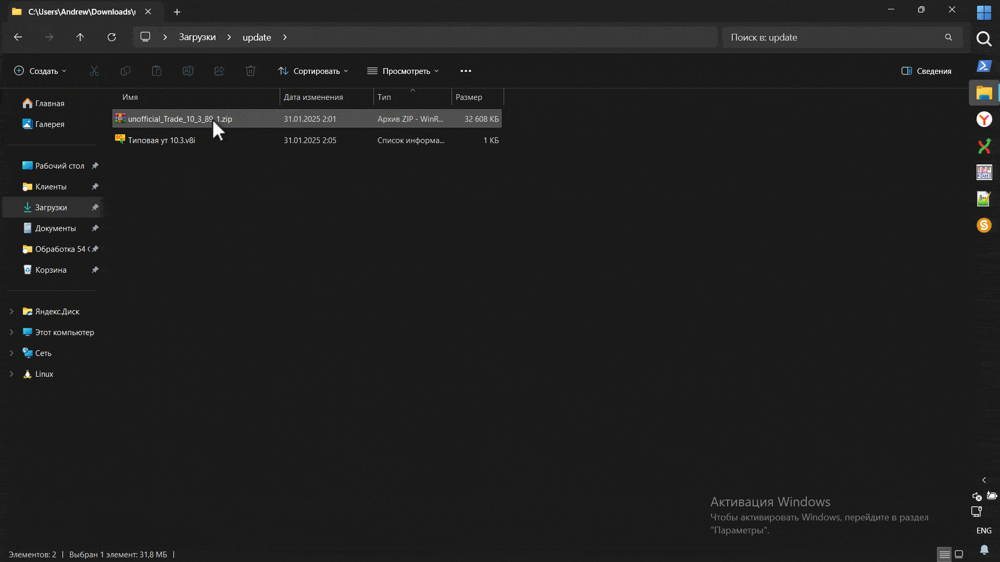

# Неофициальное обновление для конфигурации "Управление Торговлей 10.3" релиз 10.3.89.1

**Описание обновления:**  
Обновление добавляет поддержку ставок НДС 5% и 7%, обеспечивает корректную печать этих ставок на актуальных моделях торгового оборудования (АТОЛ, ШТРИХ, ревизия 4004), а также дорабатывает правила обмена с конфигурацией "Бухгалтерия предприятия 3.0" для передачи новых ставок. Новые ставки НДС поддерживается в печатных формах УПД, ТТН и т.д.

## **Что изменено:**

1. **Учетная политика:**  
   - В разделе "Налоговый учет" добавлена новая закладка **"УСН НДС"**. Она становится доступной при использовании упрощенной системы налогообложения (УСН).  
   - В закладке можно указать, является ли компания плательщиком НДС, а также выбрать применяемую ставку НДС.

2. **Механизм заполнения ставки НДС:**  
   - Если компания применяет УСН и в настройках учетной политики установлены ставки 5% или 7%, то при выборе ставки 20% или 10% она автоматически снижается до указанных в настройках значений.

3. **Отчет "Книга продаж":**  
   - Доработан для поддержки актуальных ставок НДС.
   - обновлен формат в соответствие с постановлением от "29 октября 2024г"

4. **Документ "Чек ККМ":**  
   - Ставка НДС теперь определяется не только из карточки номенклатуры, но и с учетом правил для УСН, если компания применяет пониженные ставки.

5. **Авансовые кассовые документы:**  
   - Добавлена поддержка расчетных ставок НДС 5/105% и 7/107%.

6. **Работа с онлайн-кассами:**  
   - Обновлен формат работы для поддержки ревизии 4004. Теперь кассы поддерживают ставки НДС 5% и 7%.

7. **Дополнительные материалы:**  
   - В состав дистрибутива включены обработки для обслуживания торгового оборудования ККТ нового формата (Штрих-М и АТОЛ), а также демо-версия универсальной обработки для работы с ККТ (каталог "TradeWareEpf").

8. **Обмен с конфигурацией "Бухгалтерия предприятия 3.0":**  
   - Доработаны правила обмена на основе версии 3.0.169.15. Добавлена поддержка передачи ставок НДС 5% и 7%.

---

## **Как установить:**

1. **Подготовка:**  
   - Убедитесь, что у вас установлена версия конфигурации **"Управление Торговлей 10.3.88.3"**. Это последняя актуальная версия, с которой поддерживается переход.  
   - Перед обновлением закройте все пользовательские сессии и создайте резервную копию базы данных. Это можно сделать через раздел **"Администрирование" → "Выгрузить информационную базу"** или средствами SQL, если база серверная.

2. **Распаковка обновления:**  
   - Распакуйте архив с обновлением в удобный для вас каталог.

3. **Обновление конфигурации:**  
   - Откройте конфигуратор базы данных "Управление Торговлей".  
   - Перейдите в меню **"Конфигурация" → "Поддержка" → "Обновить конфигурацию" → "Выбор файла обновления"**.  
   - Укажите путь к распакованному файлу с расширением **".cfu"**.  
   - Программа предложит автоматически обновиться на выбранную версию. Согласитесь с предложением.  
   - Примените изменения, нажав кнопку **"Обновить базу"** или клавишу **F7**.

4. **Завершение обновления:**  
   - Запустите базу данных и подтвердите применение обновления.  
   - После завершения обновления вы можете подключить торговое оборудование или актуализировать правила обмена с конфигурацией "Бухгалтерия предприятия".

---

## **Важные замечания:**

- Если правила обмена с "Бухгалтерией предприятия" были доработаны программистами, их нельзя просто заменить на типовые. Необходимо доработать уже подключенные правила.  
- Убедитесь, что используемая версия конфигурации соответствует указанной (10.3.88.3). В противном случае обновление может не сработать.

---

## **Если требуется применить типовое обновление:**

1. **Особенности текущего обновления:**  
   - Установка обновления заменяет **конфигурацию поставщика**. Это означает, что если фирма "1С" выпустит официальное обновление, автоматически на него обновиться не получится.  
   - Чтобы вернуть типовую конфигурацию поставщика, выполните следующие шаги:

2. **Возврат к типовой конфигурации:**  
   - Возьмите типовой конфигурационный файл **"Управление Торговлей 10.3.88.3"**.  
   - Откройте конфигуратор и снимите текущую конфигурацию с поддержки:  
     - Перейдите в меню **"Конфигурация" → "Поддержка" → "Снять с поддержки"**.  
   - Сравните с типовой конфигурацией из файла:  
     - Перейдите в меню **"Конфигурация" → "Сравнить, объединить с  конфигурацией из файла"** и выберите типовой файл конфигурации:
     - Платформа предложит поставить вашу конфигурацию на поддержку. Согласитесь с этим.  
     - При сравнении снимите все флажки объединения, оставив только поля **"Поставщик"** и **"Версия"**. Эти поля должны быть приведены к типовым значениям.  
     - Примените объединение.  

3. **Обновление на типовую версию:**  
   - После выполнения описанных выше шагов вы сможете обновляться на официальные версии конфигурации от фирмы "1С".  

## Как получить?
на текущий момент вы можете скачать решение на данном сайте:
- [Инфостарт](https://infostart.ru/1c/tools/2299462/)